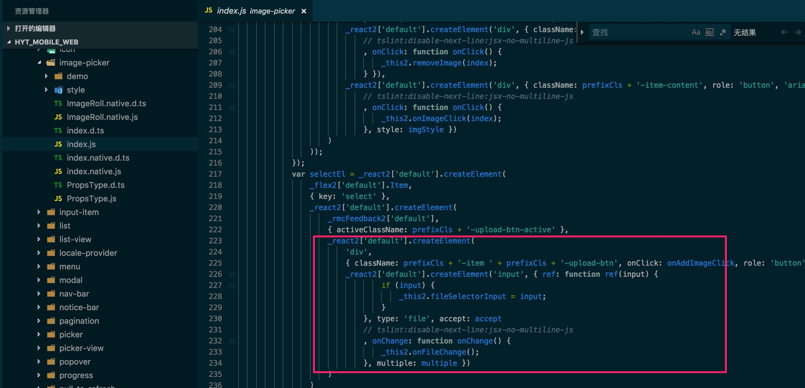

# H5调用手机摄像机、相册

在项目中使用到antd-mobile的组件[ImagePicker 图片选择器](https://mobile.ant.design/components/image-picker-cn/)做图片上传，使用起来还是很方便。

因某个业务场景要求上传的照片只能用拍照，不能从相册中选择已有照片，ImagePicker不支持此功能，所以需要对ImagePicker组件稍微改造下。

一、根据已有知识和资料搜索，确认`<input type="file">`是支持直接打开相机的，关键词是`capture`。

1. w3c的介绍：[HTML Media Capture](https://www.w3.org/TR/html-media-capture/)
2. demo1：[HTML Media Capture Examples](http://anssiko.github.io/html-media-capture/)
3. demo2：[HTML Media Capture Syntax Examples](https://addpipe.com/html-media-capture-demo/)

二、分析节点元素和源码


发现ImagePicker组件是利用的input，但是缺少`capture`。定位ImagePicker的源码（我使用的antd-mobile版本是2.1.10），主要关注点击上传时的操作。

`+` 图表代表一个input节点，点击下面的`<div class="am-flexbox-item">...</div>`发现input节点是动态生成的，结合源码可以证实这一点。



ImagePicker目前（2019-02-21 09:49:07）不支持`capture`属性，所以改造方案就是对`input`改造。下面是React项目中的解决方案，即手动添加`capture`：

```javascript
  componentDidMount () {
    const inputs = document.getElementsByTagName('input');
    for (let index = 0; index < inputs.length; index++) {
      const element = inputs[index];
      element.setAttribute("capture", true); 
    }
  }
```

