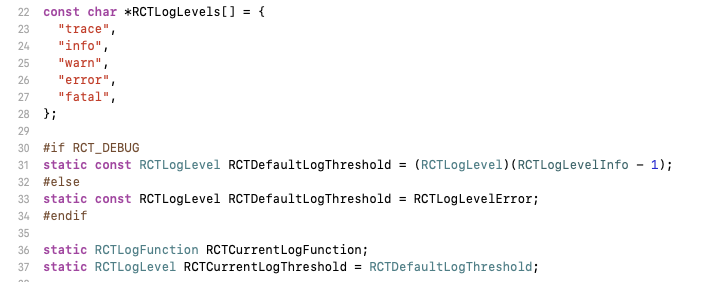
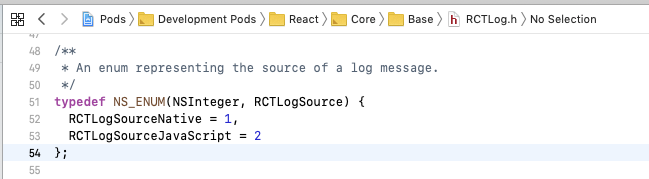
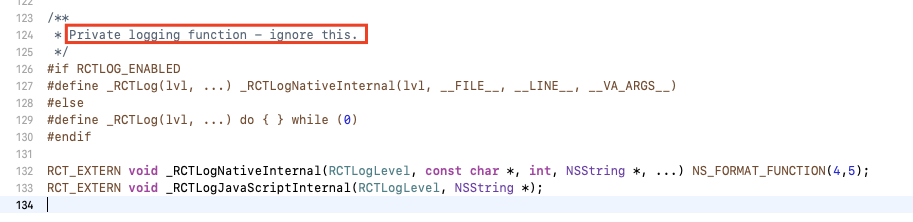

# ReactNative的日志说明
`'RCTLog.h' file not found`

这是工程的配置问题，请翻阅我[ReactNative工程搭建和改造](https://juejin.im/post/5ce50ca35188252da86da5db)，今天说说RN在xcode调试时疯狂输出日志的问题。

默认日志配置：默认级别`RCTDefaultLogThreshold`、默认打印函数`RCTDefaultLogThreshold`：



### 日志级别


- debug时，默认trace以上级别日志
- release时，默认error以上级别日志

所以，你可以更改日志输入级别，如下可以减少Debug时的日志输入，同时又可以在release时看到日志，**APP上线时要关闭日志**！！！
```
// 在AppDelegate.m里
#import <React/RCTLog.h>


#ifdef DEBUG
  RCTSetLogThreshold(RCTLogLevelInfo);
#else
  RCTSetLogThreshold(RCTLogLevelTrace);
#endif
```

### 日志来源



对应的，有两个日志函数`_RCTLogNativeInternal`、`_RCTLogJavaScriptInternal`，但是是私用的



### 日志函数


`RCTSetLogThreshold \ RCTGetLogThreshold` 是日志等级的：
```
RCTLogLevel RCTGetLogThreshold()
{
  return RCTCurrentLogThreshold;
}

void RCTSetLogFunction(RCTLogFunction logFunction)
{
  RCTCurrentLogFunction = logFunction;
}
```

`RCTSetLogFunction \ RCTGetLogFunction` 是改变默认日志打印函数的，即可以自定义打印，`RCTAddLogFunction`是在默认之外，增加日志输出方式。
```
/**
 * A block signature to be used for custom logging functions. In most cases you
 * will want to pass these arguments to the RCTFormatLog function in order to
 * generate a string.
 */
typedef void (^RCTLogFunction)(
  RCTLogLevel level,
  RCTLogSource source,
  NSString *fileName,
  NSNumber *lineNumber,
  NSString *message
);
```

```
RCTLogFunction RCTGetLogFunction()
{
  if (!RCTCurrentLogFunction) {
    RCTCurrentLogFunction = RCTDefaultLogFunction;
  }
  return RCTCurrentLogFunction;
}

void RCTAddLogFunction(RCTLogFunction logFunction)
{
  RCTLogFunction existing = RCTGetLogFunction();
  if (existing) {
    RCTSetLogFunction(^(RCTLogLevel level, RCTLogSource source, NSString *fileName, NSNumber *lineNumber, NSString *message) {
      existing(level, source, fileName, lineNumber, message);
      logFunction(level, source, fileName, lineNumber, message);
    });
  } else {
    RCTSetLogFunction(logFunction);
  }
}

/**
 * returns the topmost stacked log function for the current thread, which
 * may not be the same as the current value of RCTCurrentLogFunction.
 */
static RCTLogFunction RCTGetLocalLogFunction()
{
  NSMutableDictionary *threadDictionary = [NSThread currentThread].threadDictionary;
  NSArray<RCTLogFunction> *functionStack = threadDictionary[RCTLogFunctionStack];
  RCTLogFunction logFunction = functionStack.lastObject;
  if (logFunction) {
    return logFunction;
  }
  return RCTGetLogFunction();
}
```

下面时默认打印函数
```
RCTLogFunction RCTDefaultLogFunction = ^(
  RCTLogLevel level,
  __unused RCTLogSource source,
  NSString *fileName,
  NSNumber *lineNumber,
  NSString *message
)
{
  NSString *log = RCTFormatLog([NSDate date], level, fileName, lineNumber, message);
  fprintf(stderr, "%s\n", log.UTF8String);
  fflush(stderr);

  int aslLevel;
  switch(level) {
    case RCTLogLevelTrace:
      aslLevel = ASL_LEVEL_DEBUG;
      break;
    case RCTLogLevelInfo:
      aslLevel = ASL_LEVEL_NOTICE;
      break;
    case RCTLogLevelWarning:
      aslLevel = ASL_LEVEL_WARNING;
      break;
    case RCTLogLevelError:
      aslLevel = ASL_LEVEL_ERR;
      break;
    case RCTLogLevelFatal:
      aslLevel = ASL_LEVEL_CRIT;
      break;
  }
  asl_log(NULL, NULL, aslLevel, "%s", message.UTF8String);
};
```
