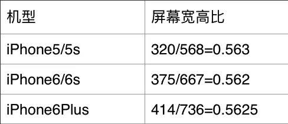

# iOS UI布局简史

**高能提醒：本文内容是个大杂烩，摘抄引用请见文章末尾的参考资料。另外，加了一些自己的见解！**

日常开发中，UI搭建、调试会占用我们大部分的时间，以至于移动端开发经常会被调侃为搭界面的。提高UI布局技术可以提高开发效率，把更多的时间放在优化、逻辑方面，而不是被界面业务绑死。

## UI布局技术概览


- nib：nib是NeXT interface builder的英文缩写，以二进制的形式存储界面信息，是IB3.0以前的文件格式。

- xib：xib是xml interface builder的英文缩写，是IB3.0之后苹果公司推出的新一代，以xml格式存储界面信息，在最终执行前，xib文件会被编译为nib文件。。。。。。（请注意大神@史前图 的评论）

- storyboard：故事版文件，是苹果最新推出的用于在界面开发中替代xib文件的一种新技术。本质上是一个xml文件的集中管理区，不但可以描述xib单个界面的结构，还可以描述界面之间的跳转及依赖关系。主要是靠手拖，感觉像积木玩具。

- frame：等效于代码版的storyboard，但更灵活。目前比较常用。如果没有好的适配方案，是多众多机型尺寸还是有点棘手。（欢迎补充最优雅的适配方案教程地址）

- AutoLayout：自动布局（AutoLayout）是iOS6发布的界面布局技术，该算法的主要思想是：将基于约束系统的布局规则（本质上是表示视图布局关系的线性方程组）转化为表示规则的视图几何参数。实际上AutoLayout算法本身并非有🍎发明，只是苹果用Objective-C去实现了该算法，方便iOS开发者使用。AutoLayout有多种使用方式，如①可视化工具：Xcode的Interface Builder，②纯代码：以[Masonry](https://github.com/SnapKit/Masonry)为代表。更多内容见[自动布局 Auto Layout (原理篇)](https://www.jianshu.com/p/3a872a0bfe11)

- FlexBox：弹性布局（Flexible Box）。对，就是目前Web端最流行的布局方式（以前是盒子模型），现在APP上也能使用。此方案就扩展出很多技术，如[Yoga](https://github.com/facebook/yoga)（最牛逼的代表，Facebook出品，衍生出很多上层方案，如跨平台的[ReactNative](https://github.com/facebook/react-native)、Android的[Litho](https://tech.meituan.com/2019/03/14/litho-use-and-principle-analysis.html)、iOS的[Yogakit](http://fanwt.com/2018/06/12/Yogakit%E4%BB%8B%E7%BB%8D/)）、[FlexboxLayout](https://github.com/google/flexbox-layout)（Android代表，Google出品）、[FlexLib](https://github.com/zhenglibao/FlexLib)、[FLEX](https://github.com/Flipboard/FLEX)等。（欢迎补充）

- swiftUI：[官网](https://developer.apple.com/xcode/swiftui/)，苹果官方推荐。更多内容见[苹果发布全新 SwiftUI 框架：一次编码，五端通用](https://www.infoq.cn/article/Puii*HdQWCDjPzvTNcKq) 

## nib

[iOS 开发中，搭建界面的一些争论](https://zhuanlan.zhihu.com/p/20783322)

## xib

[iOS 开发中，搭建界面的一些争论](https://zhuanlan.zhihu.com/p/20783322)

## storyboard

[iOS 开发中，搭建界面的一些争论](https://zhuanlan.zhihu.com/p/20783322)

## frame

通过frame编写界面，主要难点在于机型适配，而且还比较繁琐。下面是适配的2个要点：

### 非刘海机型



很明显能看出这三种屏幕的尺寸宽高比是差不多的，加上现在都屏幕尺寸都是4.7+，因此常以iPhone 6(s)为基准，进行等比缩放。在实际中可能整个页面全部、或部分节点、或仅缩放宽(或高，然后另一侧自适应) 。

```
// 在AppDelegate.h中
@property float autoSizeScaleX;
@property float autoSizeScaleY;

// 在AppDelegate.m中
#define ScreenHeight [[UIScreen mainScreen] bounds].size.height
#define ScreenWidth [[UIScreen mainScreen] bounds].size.width
 
- (BOOL)application:(UIApplication *)application didFinishLaunchingWithOptions:(NSDictionary *)launchOptions {
    AppDelegate *myDelegate = [[UIApplication sharedApplication] delegate];
   
    if(ScreenHeight > 667){ // 这里以(iPhone 6)为准
        myDelegate.autoSizeScaleX = ScreenWidth/375;
        myDelegate.autoSizeScaleY = ScreenHeight/667;
    } else {
        myDelegate.autoSizeScaleX = 1.0;
        myDelegate.autoSizeScaleY = 1.0;
    }
}
```
iPhone 6屏幕的高度是667，因此当屏幕尺寸大于iPhone 6时，autoSizeScaleX和autoSizeScaleY即为当前屏幕和iPhone 6尺寸的宽高比。如果手机为Iphone6那么屏幕比例为1，如果为Iphone6s，屏幕比放大，Iphone5就屏幕比缩小。现在我们获取了比例关系后，先来看一下如何解决代码设置界面时的适配。

`CGRectMake(CGFloat x, CGFloat y, CGFloat width, CGFloat height)`这个方法使我们常用的设置尺寸的方法，在.m文件中
```
CG_INLINE CGRect TS_CGRectMake(CGFloat x, CGFloat y, CGFloat width, CGFloat height)
{
    AppDelegate *myDelegate = [[UIApplication sharedApplication] delegate];
    CGRect rect;
    rect.origin.x = x * myDelegate.autoSizeScaleX; 
    rect.origin.y = y * myDelegate.autoSizeScaleY;
    rect.size.width = width * myDelegate.autoSizeScaleX;
    rect.size.height = height * myDelegate.autoSizeScaleY;
    return rect;
}
```
当我们使用的时候直接这样做`
UIImageView *imageview = [[UIImageView alloc] initWithFrame:TS_CGRectMake(100, 100, 50, 50)];`
这样我们得出的就是转换后的坐标了。这个imageview在5、6、6 Plus的位置和尺寸比例都是一样的。

不止是尺寸的适配，还有文字大小的适配。
```
#define MainScreenWidth [[UIScreen mainScreen] bounds].size.width

#define font(R) (R)*(MainScreenWidth)/375.0
```
所以就会经常看到下面的代码：
```
self.btnForgetPassWord = [UIButton alloc]initWithFrame:TS_CGRectMake(161, 499, 54, 12);
[self.btnForgetPassWord setFont:[UIFont systemFontOfSize:font(12)]];
```

*总之，妈妈再也不用担心屏幕的适配了。*


### 刘海机型

刘海比非刘海的区别在于多了一个安全区域SafeArea，所以最简单的办法是移除非安全区域的尺寸，然后按照非刘海机型进行适配。

常用的方法方案就是宏！
```
#define K_iPhoneXStyle ( (CGSizeEqualToSize(CGSizeMake(414, 896), [[UIScreen mainScreen] bounds].size)) || ([UIScreen instancesRespondToSelector:@selector(currentMode)] ? CGSizeEqualToSize(CGSizeMake(1125, 2436), [[UIScreen mainScreen] currentMode].size) : NO) )
// 或
#define K_iPhoneXStyle ((KScreenWidth == 375.f && KScreenHeight == 812.f ? YES : NO) || (KScreenWidth == 414.f && KScreenHeight == 896.f ? YES : NO))


// 其他宏
#define KScreenWidth ([UIScreen mainScreen].bounds.size.width)
#define KScreenHeight ([UIScreen mainScreen].bounds.size.height)
#define K_iPhoneXStyle ((KScreenWidth == 375.f && KScreenHeight == 812.f ? YES : NO) || (KScreenWidth == 414.f && KScreenHeight == 896.f ? YES : NO))
#define KStatusBarAndNavigationBarHeight (K_iPhoneXStyle ? 88.f : 64.f)
#define KStatusBarHeight (K_iPhoneXStyle ? 44.f : 20.f)
#define KTabbarHeight (K_iPhoneXStyle ? 83.f : 49.f)
#define KMagrinBottom (K_iPhoneXStyle ? 34.f : 0.f)

#define KScaleWidth(width) ((width)*(KScreenWidth/375.f))
#define IsIphone6P          SCREEN_WIDTH==414
#define SizeScale           (IsIphone6P ? 1.5 : 1)
#define kFontSize(value)    value*SizeScale
#define kFont(value)        [UIFont systemFontOfSize:value*SizeScale]
```
只考虑大部分情况其他哈~~例如横屏、新分辨率等就另说。

## AutoLayout

和frame比起来灵活性有一定增强，将尺寸影响从整体降为局部，但是在更新时使用起来还是有一定麻烦，而且新引入优先级的概念。关于更新的几个方法的区别：
- setNeedsLayout：告知页面需要更新，但是不会立刻开始更新。执行后会立刻调用layoutSubviews。
- layoutIfNeeded：告知页面布局立刻更新。所以一般都会和setNeedsLayout一起使用。如果希望立刻生成新的frame需要调用此方法，利用这点一般布局动画可以在更新布局后直接使用这个方法让动画生效。
- layoutSubviews：系统重写布局。
- setNeedsUpdateConstraints：告知需要更新约束，但是不会立刻开始。
- updateConstraintsIfNeeded：告知立刻更新约束。
- updateConstraints：系统更新约束。

更多关于Masonry的使用请移步[Masonry使用注意篇](https://www.jianshu.com/p/1d1a1165bb04)。

AutoLayout最大的问题在于需要精确的知道每一个UI元素的约束关系，当页面约束很复杂的时候，对程序员的细心和耐心是极大的考验。然而这根本不算是最严重的问题，一般页面都由若干个组件拼装而成，AutoLayout最可怕的是不支持热插拔组件，即不可以销毁一个有其他组件依赖该组件约束的组件，程序员如果想要“删除”一个组件，需要添加一个引用指向该组件的宽或高，当需要“删除”时，将该变量设为0，你以为就这么简单的完了？如果再将该组件“插入”回原处呢？

刚好FlexBox完美的解决了这个问题，请继续往后看。

*我从15年开始转iOS，当时跳过xib、storyboard，直接学习的用Masonry纯代码式布局，所以我到现在也不会Interface Builder。Masonry给我的感觉是比较枯燥的，没有所见即所得的体验，而且一个VC或View里UI代码占用了很大部分。但是熬过初级后，和其他同事协同开发、灵活性、可控性、抽象复用等方便的体验是非常棒的！*

## FlexBox

终于轮到今天的主角了！开心~~有一点Web基础的可以去[Flexbox布局详解](http://caibaojian.com/flexbox-guide.html)学习和练习。

Flexbox解决了什么？
> - 方向性 （传统布局方向是从左到右，从上至下）
> - 弹性伸缩 （传统尺寸定义是通过像素等来精确定义）
> - 元素对齐（可以做到插拔）


从上述几点看来，它似乎完美的解决了iOS原生布局开发效率低的问题，但它会增加页面的嵌套层级关系，在硬件性能饱和的情况下用空间换取开发效率。

**我相信你对它的效率有疑虑！？**（大神@史前图 的评论里指出AutoLayout的性能已经更新，所以请执行搜索相关最新的资料😄）

这里[根据从AutoLayout的布局算法谈性能](https://draveness.me/layout-performance)里的测试代码进行修改，对Frame/AutoLayout/FlexBox进行布局，分段测算10～350个UIView的布局时间,取100次布局时间的平均值作为结果，耗时单位为秒。结果如下图：（测试布局的项目代码[GitHub地址](https://github.com/ZenonHuang/MyDemos/tree/master/LayoutTest)）


虽然测试结果难免有偏差，但是根据折线图可以明显发现，FlexBox的布局性能是比较接近 Frame的。60FPS作为一个iOS流畅度的黄金标准，要求布局在0.0166667s内完成，AutoLayout在超过50个视图的时候，可能保持流畅就会开始有问题了。本次测试相关配置：Xcode9.2，iPad Pro (12.9-inch)(2nd generation) 模拟器。

### Yoga

Yoga最初源自Facebook在2014年的一个开源的CSS布局开源库，在2016年经过修改，更名为 Yoga。它是由C语言实现，基于Flexbox的一个编写视图的跨平台代码，让布局变得更简单，支持多个平台，包括Java、C#、C、Objective-C和Swift。

[Yoga Layout 官网](https://yogalayout.com/)。库开发者可以集成 Yoga 到他们的布局系统，就如Facebook 已经集成进了它的两个开源项目：[React Native](https://facebook.github.io/react-native/)、[Litho](https://fblitho.com/)、[Componentkit](https://componentkit.org/)。另外iOS开发者可以直接用YogaKit来布局视图的框架。

#### React Native

RN就不多说，目前市场上很多APP都在使用，应该说是APP跨平台开发的不二选择：

- [京东 618：ReactNative 框架在京东无线端的实践](https://www.infoq.cn/article/jd-618-ReactNative-jingdong-practise/)：这篇文章算是带我入门RN的，然后2018年初在华西公用推广RN，也参考了此篇文章。不过京东现在主推[Taro](https://taro.aotu.io/)。
- 美团：只搜到美团官方的RN技术文章，不具有代表意义。不过相信大家接触入门RN，肯定去下载过[高仿美团客户端 React-Native版](https://github.com/huanxsd/MeiTuan)。
- 携程：携程应该算是APP使用RN最多的厂家，当初还在0.48左右时就深度定制RN，如热更新、分包等，网上能搜到很多携程RN的文章，如[携程机票 React Native 整洁架构实践](https://www.infoq.cn/article/acK1*IyfqDtHoz1c14B5)。终于在2019年开源了[CRN](https://github.com/ctripcorp/CRN)，个人觉得开源得太晚了，对RN市场没有提供太大作用。
- [华医通医生端](https://apps.apple.com/cn/app/%E5%8D%8E%E5%8C%BB%E9%80%9A%E5%8C%BB%E7%94%9F/id1216580716)：我的第一个RN产品，除了IM及相关的，其他页面均是RN，占比估计85%+。

#### Litho

> Litho is a declarative framework for building efficient user interfaces (UI) on Android. It allows you to write highly-optimized Android views through a simple functional API based on Java annotations. It was primarily built to implement complex scrollable UIs based on RecyclerView. With Litho, you build your UI in terms of components instead of interacting directly with traditional Android views. A component is essentially a function that takes immutable inputs, called props, and returns a component hierarchy describing your user interface.

> Litho是高效构建Android UI的声明式框架，通过注解API创建高优的Android视图，非常适用于基于Recyclerview的复杂滚动列表。Litho使用一系列组件构建视图，代替了Android传统视图交互方式。组件本质上是一个函数，它接受名为Props的不可变输入，并返回描述用户界面的组件层次结构。

Litho是一套完全不同于传统Android的UI框架，它继承了Facebook一向大胆创新的风格，突破性地在Android上实现了React风格的UI框架。架构图如下：


我对Android开发不熟，所以请移步[基本功 | Litho的使用及原理剖析](https://tech.meituan.com/2019/03/14/litho-use-and-principle-analysis.html)。

#### YogaKit

iOS端Yoga的上层UI库Componentkit，但是我看文档之后觉得非常难用，所以略过。

但是**YogaKit**还不错，同时支持OC和Swift，[Yoga 教程-使用跨平台布局引擎](https://iangeli.com/2018/04/16/Yoga%E6%95%99%E7%A8%8B.html) 这份基于Swift的YogaKit教程还不错。

ps：我本想找一个Masonry的替代者，特别希望能支持Flex布局，所以抱有很大希望去了解和学习YogaKit，但是失望😞了。第一是代码繁琐，第二是YogaKit的使用者不多。我还是好好研究RN吧~

### FlexboxLayout

[FlexboxLayout](https://github.com/google/flexbox-layout)是谷歌出的，只支持Android，所以期待各位大神关于此框架的评论。

*顺便吐槽一句，google是看着什么语言和技术火，都会插一脚，然后独自开发一套。如golang、angular、android studio、dart、flutter等，加上国内技术开发者的google情节，所以你们自己体会。。。除了JS引擎——V8*

### swiftUI

iOS上的UI，我觉得swiftUI才是以后的王者！我不接受反驳，哈哈哈哈哈哈...iOS的UI开发语言就objective-c和swift，从编译型的oc变为解释型的swift，从语言角度看跨度还是挺大的，在众多技术均在快速发展的现代，解释型语言更能适应未来，不过swift还未在跨平台上发挥出任何两点，就连在iPhone和mac上都没。

如果没有swift的从入门到再入门事件，可能swift的市场又是另外一番景象！真希望swift 5能稳定下来。

## 后语

UI的基础布局也就那么回事，都是从图形绘制OpenGL，到UI Library，再到UI Controls，再到APP，电脑发展到现在一直没有变过，如Windows上的MFC、iOS上的UIKit、刚出来的flutter等。

此处借鉴TCP/IP的七层模型（我觉得这是世界上最牛逼的架构，没有之一，不接受反驳！），只有分层之后，不同的人员才能扮演不同的角色，去完成对应的工作。我们说的UI是软件层面的，是运行在硬件上的，所以软件到硬件的衔接要靠图形绘制，这个工作是由操作系统去完成。

有了操作系统这个大环境，为了建立生态，必须对外提供响应的开发套件，如UI库、网络库、驱动库等，这一点在Windows提现特别明显。然后开发者才会加入你的开发阵营，然后你的市场才会逐步扩大，所以为啥经常听说一门语言和技术背后，也需要强大的公司和资金来支持，比如微软、谷歌、亚马逊、Facebook、众多第三方厂商的SDK等等，请注意像阿里云SDK、腾讯SDK等各个厂商也算是这一层的，可以把Windows、Android、iOS等操作系统看着是一级厂商，把Facebook、阿里云、腾讯云等服务提供商是二级厂商。

有了各个等级厂商提供的Library和对应的Control，然后才能更好的创造出百花齐放的APP，才有我们这种出现不同方向的软件开发者。所以看待一个新的UI库或技术，需要从其原理和应用分析，找到其合适的定位，如果你没有深入分析背后的技术，是无法发挥其最大价值的。

就像React Native，你特么叫我去做IM和多媒体，老子一巴掌给你飞过来！RN它只是写降低了APP UI的门槛，扩大了其受众者，就如React的口号『**learn once write anywhere**』。RN的大致原理是通过JavaScript和JavaScript解释器，去动态控制原生的UI布局，和以前有大神通过解析XML去自动生成UI，是一样的道理，又如**Lua**这个同JavaScript语法类似的脚本在游戏行业活得风生水起，RN的热更新原理就是这么来的——通过更新JavaScript文件达到更新UI布局和业务逻辑等目的，所以RN的核心是在具有ES 6/7/8/...的JavaScript和对应的JavaScript解释器，关于RN中的JavaScript解释器，可以看看[逆袭Futter? Facebook 发布全新跨平台引擎 Hermes！](https://mp.weixin.qq.com/s?__biz=MzIyMjQ0MTU0NA==&mid=2247490343&idx=1&sn=2d7103bb3825fa87e6e334bd64a17a5f&chksm=e82c2200df5bab16643a4c035b344fb4525838351678b7ae5889da5ba487359e9afec6ddb83c&mpshare=1&scene=1&srcid=&key=2f4703df4564706ad813f74bdbbc290fc448c)、[JS引擎大PK：JSC vs V8 vs Hermes](https://mp.weixin.qq.com/s/I1IzyI9EUd-NPW6TTv7N8A)。


不限于RN，你想要做得更好更优秀，你需要多研究。不要想着你会React网页，就觉得可以来做APP，呵呵，一个库依赖问题就能把你搞死。不是你长的美，就可以想得美！就好比让你用openGL的API来画一个控件，你画不好，然后就说openGL技术不行？！这时我只能送你一个字，滚！

**说了这么多，我不是希望任一一个UI库有多牛逼，而是希望FlexBox这个UI规范能在APP端能扩大影响，尽量和在布局上更优秀的Web端保持一致，最终实现统一，做到最根本的跨平台，但是可以有很多库或者方案来实现。**

<br/><br/>
<hr/>

2019-07-28 更新：
下面评论 @小二Flutter 提到的[MyLinearLayout](https://github.com/youngsoft/MyLinearLayout)也很优秀很强大，新旧布局方案均兼容，各位技术官可以去尝试一下，说不定你也喜欢。但是我觉得文档不是完善，特别是使用方面的，会导致上手难度增大。

下面评论 @史前图腾 提到的iOS布局历史，本文中提到的有些不对，请注意甄别！（我想修改，但是不知道怎么修改😔）。

<br/><br/>
参考资料：(排名不分先后)

- [自动布局 Auto Layout (原理篇)](https://www.jianshu.com/p/3a872a0bfe11)
- [iOS 上的 FlexBox(箱式) 布局及yogaKit框架使用](https://www.jianshu.com/p/652460c4fb67)
- [从 Auto Layout 的布局算法谈性能](https://draveness.me/layout-performance)
- [iOS 如何使用facebook开源的YogaKit(一)](https://www.jianshu.com/p/c88fa8df0446)
- [Flexbox布局详解](http://caibaojian.com/flexbox-guide.html)
- [iOS屏幕适配(纯代码)](https://www.jianshu.com/p/446099c6cdad)
- [几行代码帮你轻松完成ios屏幕适配](https://blog.csdn.net/zthhsa/article/details/77574168)
- [iOS 关于全面屏适配的方案及UI在不同尺寸下适配方案](https://juejin.im/post/5bd2a094518825289f7f3d17)
- [Masonry使用注意篇](https://www.jianshu.com/p/1d1a1165bb04)
- [京东 618：ReactNative 框架在京东无线端的实践](https://www.infoq.cn/article/jd-618-ReactNative-jingdong-practise/)
- [携程机票 React Native 整洁架构实践](https://www.infoq.cn/article/acK1*IyfqDtHoz1c14B5)
- [基本功 | Litho的使用及原理剖析](https://tech.meituan.com/2019/03/14/litho-use-and-principle-analysis.html)